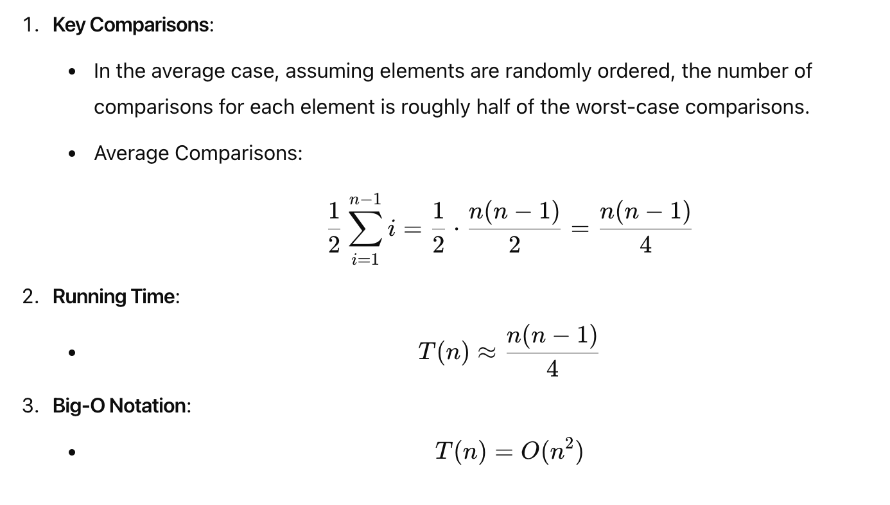
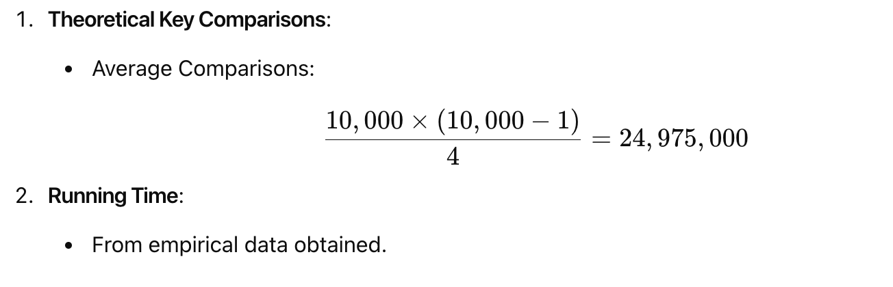

# Empirical Analysis of Algorithms

## Project Overview

This project involves the empirical analysis of the Insertion Sort algorithm. The primary goal is to analyze the algorithm's performance, specifically the number of key comparisons and running time for sorting an array of orderable elements.

## Corrected Pseudocode for SortAnalysis

```python
def SortAnalysis(A):
# Input: An array A[0..n-1] of n orderable elements
# Output: The total number of key comparisons made
count = 0
n = len(A)
for i in range(1, n):
v = A[i]
j = i - 1
while j >= 0 and A[j] > v:
count += 1
A[j + 1] = A[j]
j -= 1
if j >= 0:
count += 1
A[j + 1] = v
return count
```

## Hypothesis about the Algorithm’s Average-Case Efficiency

### Insertion Sort Algorithm

Insertion Sort is a simple sorting algorithm that builds the final sorted array one item at a time. Although it is less efficient for large lists compared to more advanced algorithms like quicksort, heapsort, or merge sort, it has several advantages:
- Simple to implement
- Efficient for small data sets
- Stable (does not change the relative order of elements with equal keys)
- In-place (requires a constant amount of additional memory space)

### Average-Case Efficiency Analysis



## Empirical Data Analysis

### Estimation for a Randomly Generated Array of Size 10,000

To estimate the number of key comparisons and the running time for an array of size 10,000, we use the derived average-case formula:



## Scatter Plot

The project includes generating a scatter plot to visualize the performance of the Insertion Sort algorithm based on the empirical data.

## Files

- `sort_analysis.py`: Python script implementing the Insertion Sort algorithm and performing empirical analysis.

## How to Run

1. Clone the repository.
2. Ensure you have Python installed on your machine.
3. Run the `sort_analysis.py` script to perform the analysis.

```bash
python sort_analysis.py
```

## Conclusion

This project demonstrates the empirical analysis of the Insertion Sort algorithm, highlighting its performance in terms of key comparisons and running time for different input sizes.
